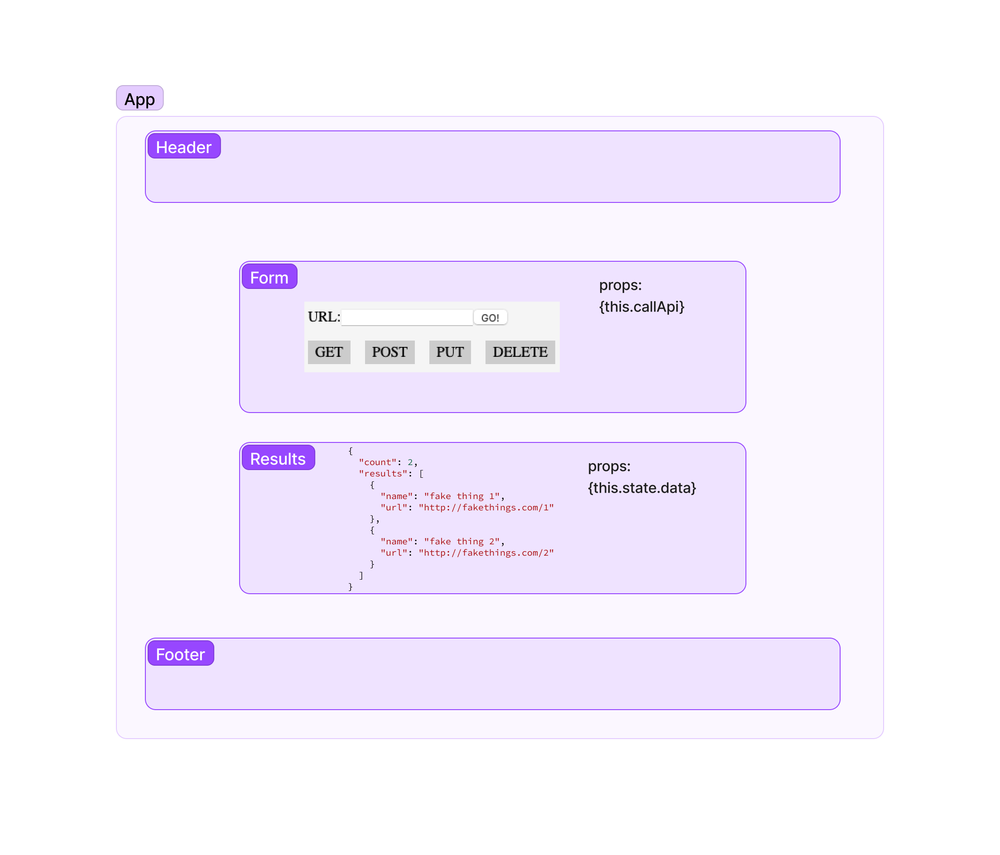

# LAB - Class 26

## Project: Component Based UI

### Author: Donna Ada

### Problem Domain  

RESTy Phase 1: Begin work on the RESTy API testing application.
RESTy Phase 2: Retrieving User Input and Managing State.
RESTy Phase 3: Connect RESTy with APIs, running live requests.

#### Code Sandbox Links

- [Part 1/4 Link](https://codesandbox.io/p/github/donnaada/resty/base?workspaceId=ce71875d-ef6e-4f5c-a373-7db91650ae14)
- [Part 2/4 Link](https://codesandbox.io/p/github/donnaada/resty/state?workspaceId=ce71875d-ef6e-4f5c-a373-7db91650ae14)

#### UML

